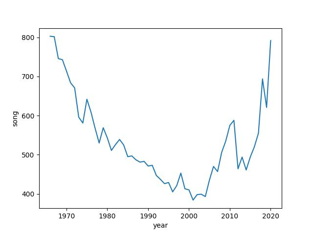
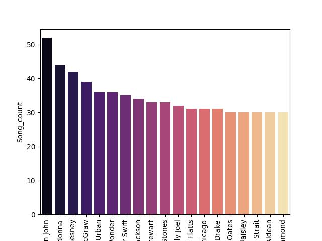

**Answer 1:** The data contains a list of 10 artists with the count alonside them. It shows that all these songs were massive hits and have been in the top 100 for over one year. Considering that there are 1000s of songs released frequently, it is a significant achievement. 

**Answer 2:** 

There is a three part solution to the question. The first segment is the trend where every year the number of unique songs decrease. We can see that there was a decrease of 400 songs in 30 years, depicting that people did not like trying newer songs every week, and there was consistency in the kind of songs people listen to. The decades 1990 and 2000s show that people were consistent in listening in the set of sogns that they liked, and did not like a lot of changes. 
From around 2005-2008, we can see a steep rise and fall in songs. We can say that is because of the internet boom of Facebook, Instagram, Youtube and TikTok. There were trends which were being followed on these pages. People were more aware of the hidden gems, and which gained momentum to become hits. We see such volatile trends mainly because the trends were fast moving, we could expect that there would be trends on some days, on other days, it would be a aggressive trend. 

**Answer 3:** 

As mentioned in the question, there are 19 singers who had 30 songs on on billboard for 10 weeks. Very similar on the trend discussed above, most of the singers are from the era of 1970s to 2000s, the time where people didnt like to experiment much with the songs. There are obviously outliers like Taylor Swift and Drake. But lets be honest, everybody loves Taylor Swift. No data analysis will help us to fit her in any trends, she has her own trends. Apart from that, we can see that male singers have been able to acheive more hit songs than female singers. Madonna and Taylor Swift(obviously) were the only female songers with 30+ songs. 

