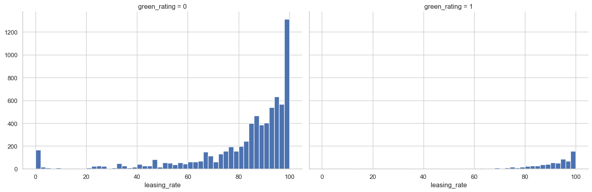
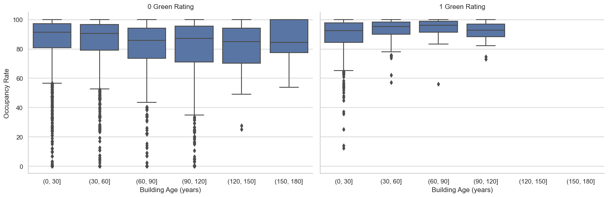
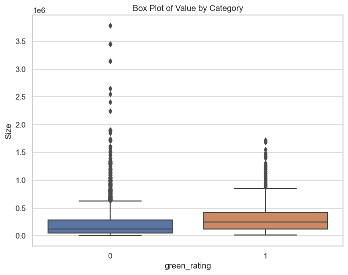
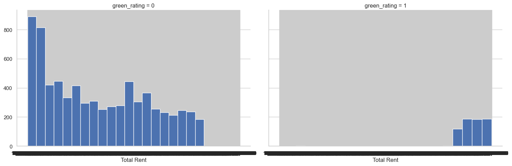

# Visual Story telling

In the analysis of whether investing in green-certified buildings is economically beneficial, several important observations have been made.

Firstly, the number of properties with low occupancy rates is higher among non-green-rated apartments. Removing these low-occupancy properties might not be justified without understanding the underlying reasons. Moreover, the median rent values before and after such removal are similar, indicating the need for a more thorough examination of leasing rates.

Exploring further, it's evident that green-rated buildings generally exhibit higher occupancy rates, which could be attributed to their relatively new construction.

However, age analysis reveals that older green buildings (60-120 years) tend to have higher occupancy rates compared to older non-green buildings. Additionally, the distribution of rent values shows a higher values for green buildings.

Considering building size, green-rated properties tend to have slightly larger areas, often being preferred by larger corporations.

Furthermore, a calculated metric combining size and rent confirms that green-rated buildings generate higher total rental earnings.

These findings collectively support the conclusion that investing in green-certified buildings appears economically advantageous, potentially yielding higher long-term profits.
