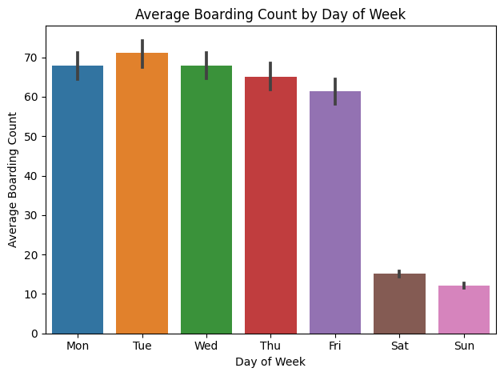
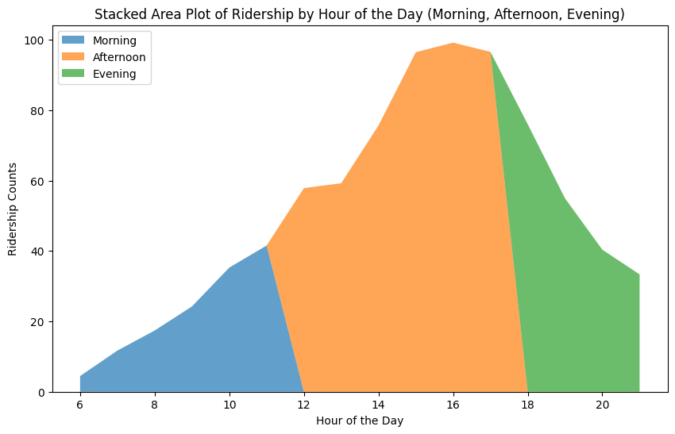
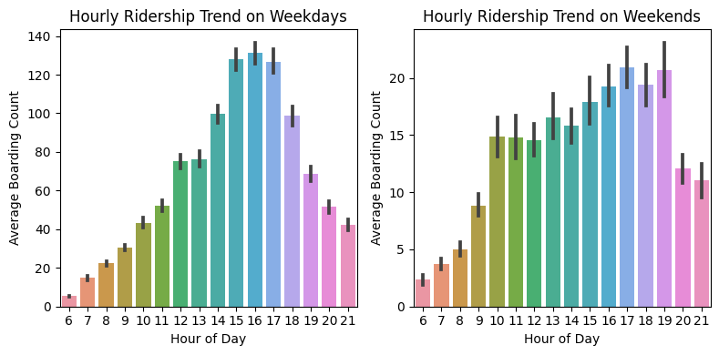
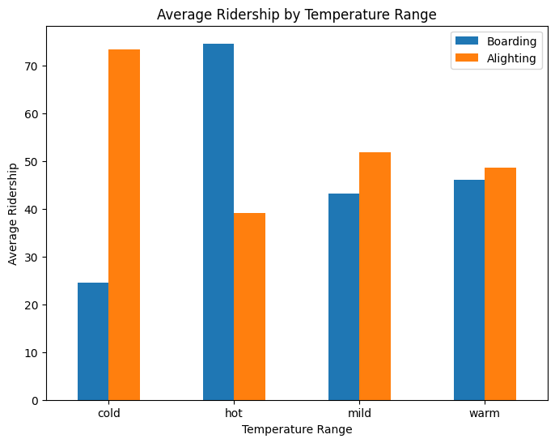

# STA380_RMS

## 1. Boarding count by day of the week

We see that on average boarding count tends to remain highest on first couple of days in the week with Tuesday seeing the highest boarding count. This is probably because most students take their university classes on these days. Also, we find that ridership level on weekdays is way higher than weekends probably because most of the riders might be UT students who use the metro system for navigating through the campus.

## 2. Ridership trend by time of the day

As expected the bulk of ridership happens during afternoon time which covers most of the university class hours. What will be interesting to check is whether this is consistent for weekdays and weekens or are there any differences.

## 3. Hourly ridership trend [weekday vs weekend]

This is interesting!! While on weekdays we see a clear spike in usage from 3PM to 5PM on weekdays, the weekends tend to exhibit a consistent pattern across most of the day with afternoon still seeing the highest usage.
One potential reason for afternoon seeing the highest ridership might be high temperature values which make it difficult to walk across the campus. Lets check this through our data!!!

## 4. Ridership by Temperature range

AHAAA!!! This is what we assumed. There is a clear patternbetween boarding and temperature. Generally more people tend to board the metro when the temperature outside is hot!!

## Conclusion

Let's summarize our findings below:

1.On average boarding count tends to remain highest on first couple of days in the week with Tuesday seeing the highest boarding count

2.Ridership level on weekdays is way higher than weekends

3.Bulk of ridership happens during afternoon time

4.Generally more people tend to board the metro when the temperature outside is hot
