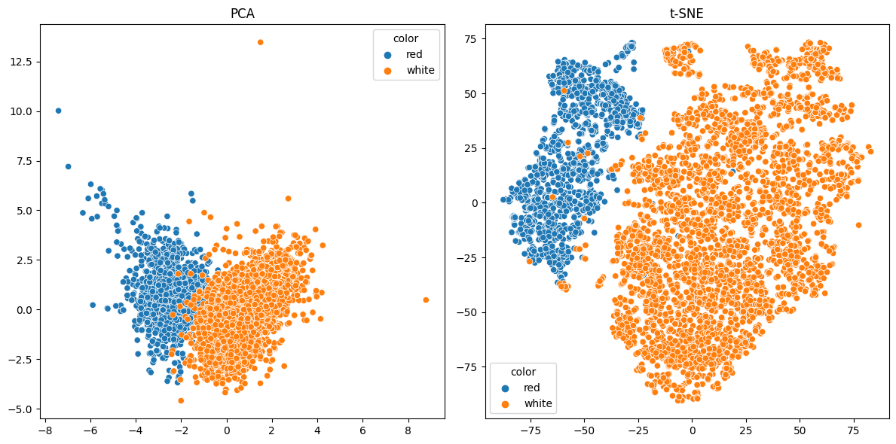
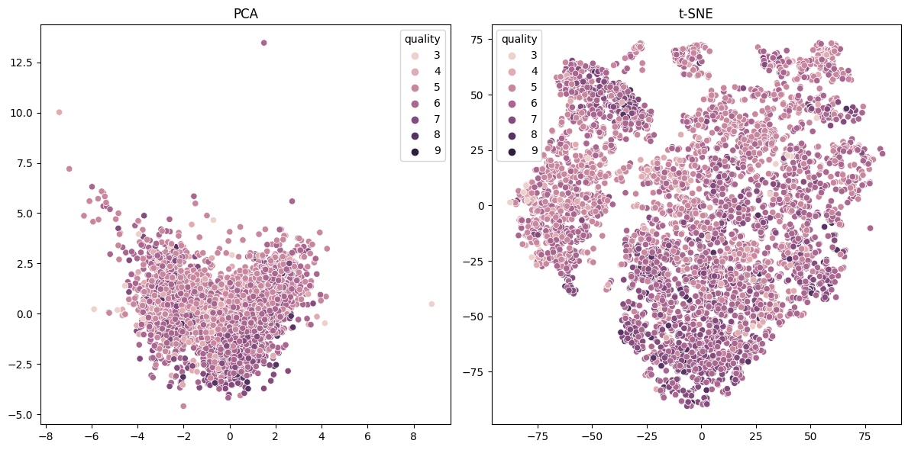

# Clustering and Dimensionality Reduction

Based on the analysis of the wine dataset using PCA, t-SNE, and K-means clustering, we can draw the following conclusions:

## Distinguishing Wine Color

Both PCA and t-SNE are effective in distinguishing between red and white wines based on the chemical properties.

However, PCA provides a slightly clearer separation between the two colors compared to t-SNE. K-means clustering using the dimensions from PCA creates well-defined clusters, with each cluster representing either a white wine or a red wine. This indicates that unsupervised techniques are capable of differentiating wine colors based on the chemical properties.

## Distinguishing Wine Quality

Both PCA and t-SNE perform poorly in distinguishing the quality of the wine. There are no distinct clusters forming based on the quality variable, and the points are scattered across the plot.

When applying K-means clustering on PCA or t-SNE results for wine quality, we observe that the clusters formed do not correspond to specific quality levels or ranges. This suggests that the unsupervised techniques are not effective in clustering the wines based on their quality.

Overall, while both PCA and t-SNE are useful for identifying certain patterns in the dataset, they have limitations when it comes to distinguishing the quality of the wines. The chemical properties seem to have more influence on color than on quality. For color-based clustering, K-means clustering using PCA dimensions provides clear and meaningful clusters. However, for quality-based clustering, these techniques do not yield interpretable results.

These findings highlight the importance of understanding the underlying characteristics of the data and the goals of the analysis when choosing the appropriate dimensionality reduction technique and clustering algorithm. It's also a reminder that some variables might not be well-suited for unsupervised techniques and may require other methods or more contextual information for accurate analysis.