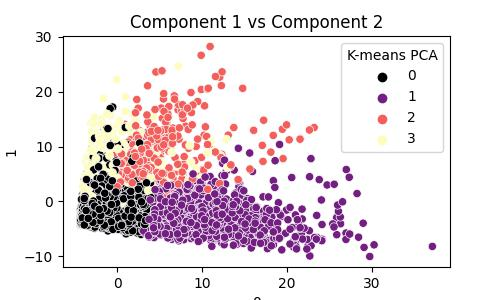

We have assumed that the client is a nutrition company, trying to market a healthy product to their followers. 
From our data. We have dropped all users who have posted more than 10 adult tweets. 
We have segmented the rest of the users in 3 parts.

Segment 1- No Data
This segment did not provide with any substantial amount of data. These account for 72%(5693) of the followers

Segment 1 - Nutrionists.
These are the users who are actively interested in nutrition and fitness. We can see that these are the group of people who mostly tweet about cooking, fitness and healthy nutrition. These account for 24%(1132) of the followers

Segment 2- The Influencers
These are the users who are actively interested in sharing a pompous life on social media. They are highly interested in cooking, beauty and fashion and tend to share those photos online. They could be a small group of people, but they have the ability to help with the maximum engagement. These account for 7.5%(591) of the followers. 

Segment 4 - GenZ
This segment contains mainly of college students and online gamers. Once again they account for a small amount of people, but have the potential to help a lot in mass engagement among the users. These account for 5.6% (445) of the followers.

The data is collected in the course of a market-research study using followers of the Twitter account of a large consumer brand "NutrientH20". The goal here is for NutrientH20 to understand its social-media audience a little bit better, so that it can hone its messaging a little more sharply.
The data contains 36 odd rows related to the interests of a user via a set of tweets that they made over a period of 7 days.

We used a combination of PCA and K-means Clustering to segment the data in various groups to understand the typical patterns of the followers of NutrientH20. We were able to segment the followers in 4 groups and named those groups as 'Randon Profiles','Nutrionists','Influencers' and 'GenZ'. We tried correlation analysis, but it didn't give us expected results because of low correlation between most of the columns. 
K-means was not able to perform well as a standalone model, mainly due to the high dimensionality of the data, hence we used PCA for dimensionality reduction.

Insights and Recommendations: 
# Nutrionists 
- A marketing activity can be carried out to cater to the nutritionists of the group. Probably a discount activity to offer products who would share their existing nutrition regime, or a giveaway to the winners of a fitness contest. NutrientH20 should start publishing Nutrition tips and tricks, which the "Nutritionists" can use and share among their groups and communities.

# Influencers
- This group contains of people who are interested in posting photos about cooking and fashion. On the similar lines of the previous contest, we could run a marketing campaign to let people make food and upload photos by tagging NutrientH20, and the winners could be given a discount on their next order. This contest will help in increasing outreach and also help gain an insight on NutrientH20's customer's eating habits. 

# GenZ
- A quiz on online gaming or a fun activity for college students could help penetrate the reach in the student market. This activity can be engaging for students, they could invite their friends to participate as well.

By following these steps, NutrientH20 can gain a deeper understanding of its social-media audience and tailor its messaging to connect with different segments more effectively.
