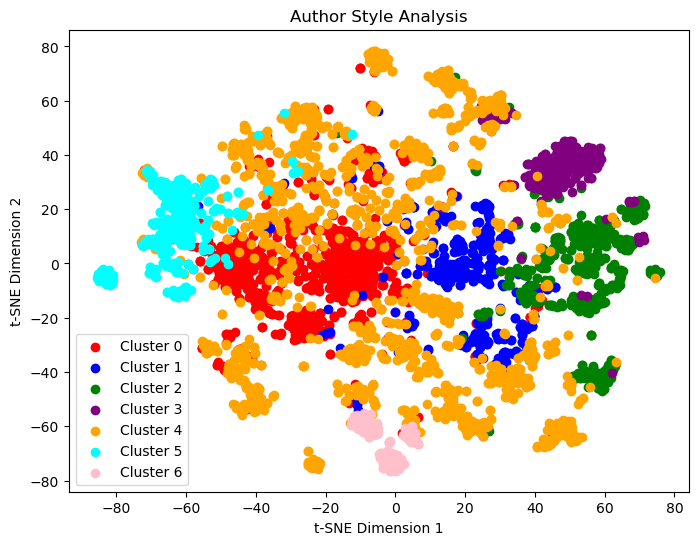

# STA380_RMS

## Approach
### For this problem statement we tried to solve 3 basic questions¶
1.Divide authors into different clusters by writing style using t-SNE and k means clustering.
2.Use Latent Dirichlet Allocation (LDA) to perform topic modelling on the corpus of data and find the top keywords associated to the selected topic.
3.Create a author classification model to predict the authors associated with a particular text by providing an average sentiment score.

## 1.Clustering 

## Result Interpretation
a)Some very strong and clear clusters can be observed in the dataset. For example cluster 2, cluster 3, cluster 5 and cluster 6 look to be closely associated in feature space.
b)Interested stakeholders can use these results for wide variety of operations like:
-Tailoring content recommendations for specific writing clusters
-Identifying and nurturing emerging authors with unique styles
-Enhancing content personalization by understanding writing preferences

## 2.Topic Modelling using LDA

### List of selected topics

### Interactive visualisation using pyLDAvis library

Result Interpretation
-Our model identified a set of 10 topics within the corpus of text documents and displays top keywords for each identified topic to provide an understanding of the primary themes or content associated with each topic.
-We used pyLDAvis library to create an interactive visualization of the topics. This visualization helps in comprehending the distribution of topics and their relationships within the text data.
-Some possible Applications:
1.Stakeholders can identify the top keywords associated with each topic to categorize and label different content themes.

2.By understanding the primary topics of the documents, stakeholders can curate and recommend relevant content to users based on their interests.

3.Stakeholders can gain insights into the most prevalent topics across the dataset. This information can guide content creation strategies and help identify content gaps.

## 3. Author Classification

### Model summary comparison

### Suggestions to Improve Accuracy:

1. Feature Engineering:
We can explore additional features or derived features that could capture more nuanced information about the text. Like word embeddings, syntactic features, or document-level statistics.

2. Hyperparameter Tuning:
We can experiment with different hyperparameters for each model. Grid search or random search can help identify optimal parameter combinations.

3. Advanced Models:
We can experiment with more advanced models such as deep learning architectures (e.g., LSTM, CNN) that can capture complex patterns in text data.
