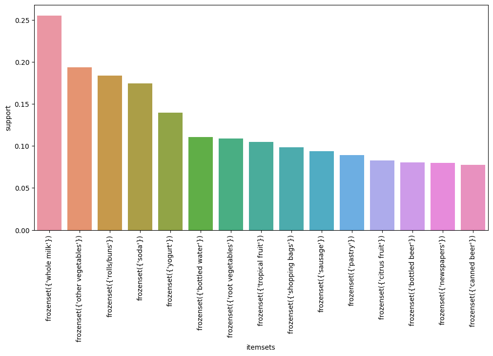
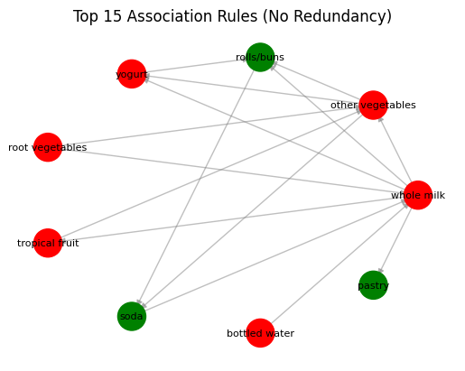
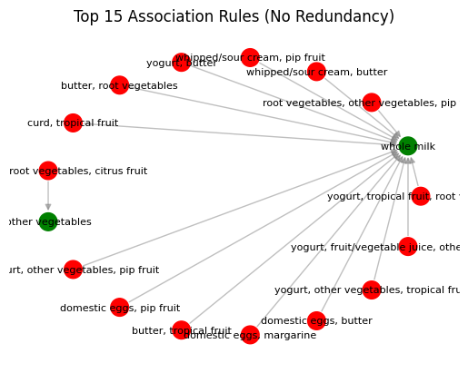
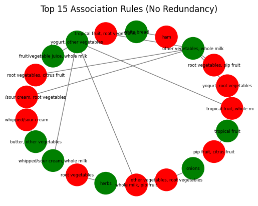

# STA380_RMS

## General Approach
1.Preprocessing and preparing the data for association rules analysis
2.Generating frequent item set
3.Calculating top 15 association rules between the items using 'support', 'confidence' and 'lift' and interpreting results

## Frequent Items

Whole milk, vegetables, rolls/buns, soda and yogurt are the most sold items

## Association rules based on 'Support', 'Confidence' and 'Lift'

### 1. Top 15 association rules based on support withmin threshold of 2%
Support measures the frequency of occurrence of a specific itemset (combination of items) in the dataset. It tells you how popular or prevalent the itemset is in the data.

Rules based on support:

1.whole milk, vegetables, rolls/buns and yogurt tend to be bought together
2.milk, fruits and vegetables are also bought together
3.Milk and pastry are bought together

### 2.Top 15 association rules based on 50% confidence
Confidence measures the reliability or strength of a rule. It indicates the likelihood that an item in the consequent (output) of the rule appears in the transaction given that the items in the antecedent (input) of the rule are already present.

Rules based on confidence:

1.Whole milk seems to be the item with highest association with other proucts. People generally tend to buy milk with, vegetables, fruits, rolls,eggs,butter and yogurt. So it can be placed in the middle aisle for easier accessibility.
2.fruits and vegetables are also bought together and can be placed in side-by-side sections

### 3. Top 15 association rules based on lift
Lift measures the strength of the association between the items in the antecedent and the items in the consequent, while taking into account the baseline occurrence of the consequent. It compares the observed support of the rule to what would be expected if the items were independent.

Rules based on lift:

1.Whenever people buy ham they tend to buy white bread
2.Whenever people buy root vegetables they tend to buy herbs
3.Vegetables, milk, fruit and yogurt are bought together

Hence all these sections can be placed in closeproximity of each other for a better buying experience
