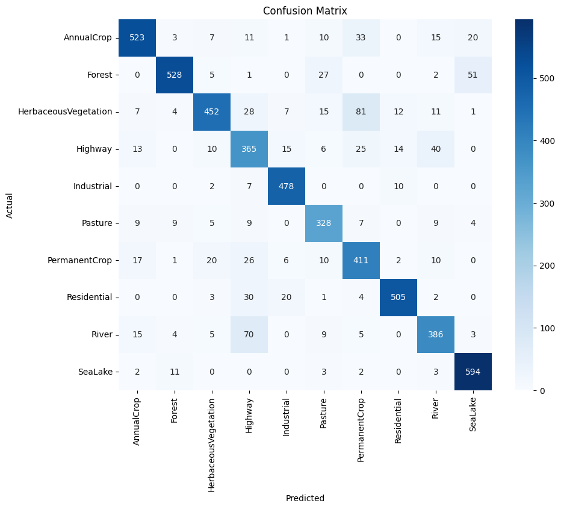
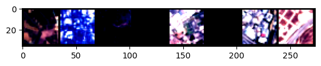

# Image Classification

We are trying to classify sattelite images using neural networks

Certainly! This code defines a Convolutional Neural Network (CNN) model for image classification. Let's break down the layers in this network:

1. **Convolutional Layers:**
   The convolutional layers extract features from the input images. Each convolutional layer consists of a convolutional operation followed by a non-linear activation function (ReLU) and a max-pooling layer. These layers help the network learn hierarchical features in the data.

   - **First Convolutional Layer:**
     - Input: 3-channel images (representing RGB channels)
     - Output: 16 feature maps (output channels)
     - Kernel Size: 3x3 (3x3 convolutional kernel)
     - Padding: 1 to maintain spatial dimensions
     - Activation: ReLU (Rectified Linear Unit activation function)
     - Max-Pooling: 2x2 (downsamples the feature maps)

   - **Second Convolutional Layer:**
     - Input: 16 feature maps from the previous layer
     - Output: 32 feature maps
     - Kernel Size: 3x3
     - Padding: 1
     - Activation: ReLU
     - Max-Pooling: 2x2

2. **Flatten Layer:**
   After the convolutional layers, the feature maps are flattened into a vector. This step is necessary to transition from spatial data to a format suitable for fully connected layers.

3. **Fully Connected (Linear) Layers:**
   The flattened vector is passed through a series of fully connected layers that progressively reduce the dimensionality and produce class predictions. Each fully connected layer is followed by a ReLU activation function, except for the last one.

   - **First Fully Connected Layer:**
     - Input: Flattened vector from the convolutional layers (32 \* 8 \* 8 = 2048 dimensions)
     - Output: 128 dimensions
     - Activation: ReLU

   - **Second Fully Connected Layer (Output Layer):**
     - Input: 128 dimensions from the previous layer
     - Output: Number of classes in the dataset (determined by the length of `dataset.classes`)
     - No activation function here, as it's the output layer

The overall architecture of this CNN involves alternating convolutional and max-pooling layers to extract spatial features, followed by fully connected layers to perform classification based on the extracted features.

After running the training the model and applying it on the test set we got an accuracy of 85%
We plotted a confusion matrix to see how the images are classified:

Here's a small snippet of 8 test images and their classifications:

6 4 2 9 4 9 4 3
